# Yin-Yang puzzles and hardness figures via SVG Tiler

## Erik Demaine, Jayson Lynch, Mikhail Rudoy, Yushi Uno

Yin-Yang / Shiromaru-Kuromaru (白丸黒丸)
is an NP-complete pencil-and-paper puzzle dating back to at least 1994.
See [our paper about it](https://erikdemaine.org/papers/YinYang_CCCG2021/).

This repository contains the Yin-Yang puzzles and gadgets from that paper,
in two formats:

* **ASCII**: This format is how we manually entered the figures, and is great for
  computational processing (e.g. checking solutions).
* **SVG**: This rendered format presents the figures for human consumption.

## SVG Tiler

SVG files are generated from the ASCII files using
[SVG Tiler](https://github.com/edemaine/svgtiler).
Specifically, [`yinyang.coffee`](yinyang.coffee) defines the mapping from
ASCII characters to SVG symbols.
You can use this definition file to render your own Yin-Yang puzzles or figures,
by creating your own ASCII diagrams.
To build the figures,
[install SVG Tiler](https://github.com/edemaine/svgtiler#installation)
clone this repository, and run `make`.
(Run `make pdf` if you want to build PDF figures.)

## Checking Solutions

[`test.coffee`](test.coffee) checks whether a given ASCII puzzle solution
satisfies the rules of Yin-Yang: no monochromatic 2&times;2 squares, and
exactly two connected components (one per color).
To run these checks on the included puzzle solutions,
[install CoffeeScript](https://coffeescript.org/) and run `make test`.

## Puzzles

In case you want to work on a puzzle, we just show the puzzle here.
Click on any puzzle to reveal its solution.

### Simple Puzzle

This is a simple 5&times;5 puzzle from Figure 1 of the paper.

[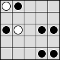](puzzles/simple_solved.svg)

### Spiral Puzzle

This is a simple 5&times;4 puzzle that used to be Figure 1 of the paper,
but the symmetry (inspired by an actual yin-yang symbol) was confusing.

[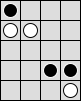](puzzles/spiral_solved.svg)

### Reduction Puzzle

This is a huge 82&times;80 puzzle from Figure 10 of the paper,
representing an entire reduction from a 5-vertex instance of
Planar 4-Regular Tree-Residue Vertex Breaking
(a 4-wheel with two outer edges doubled).

[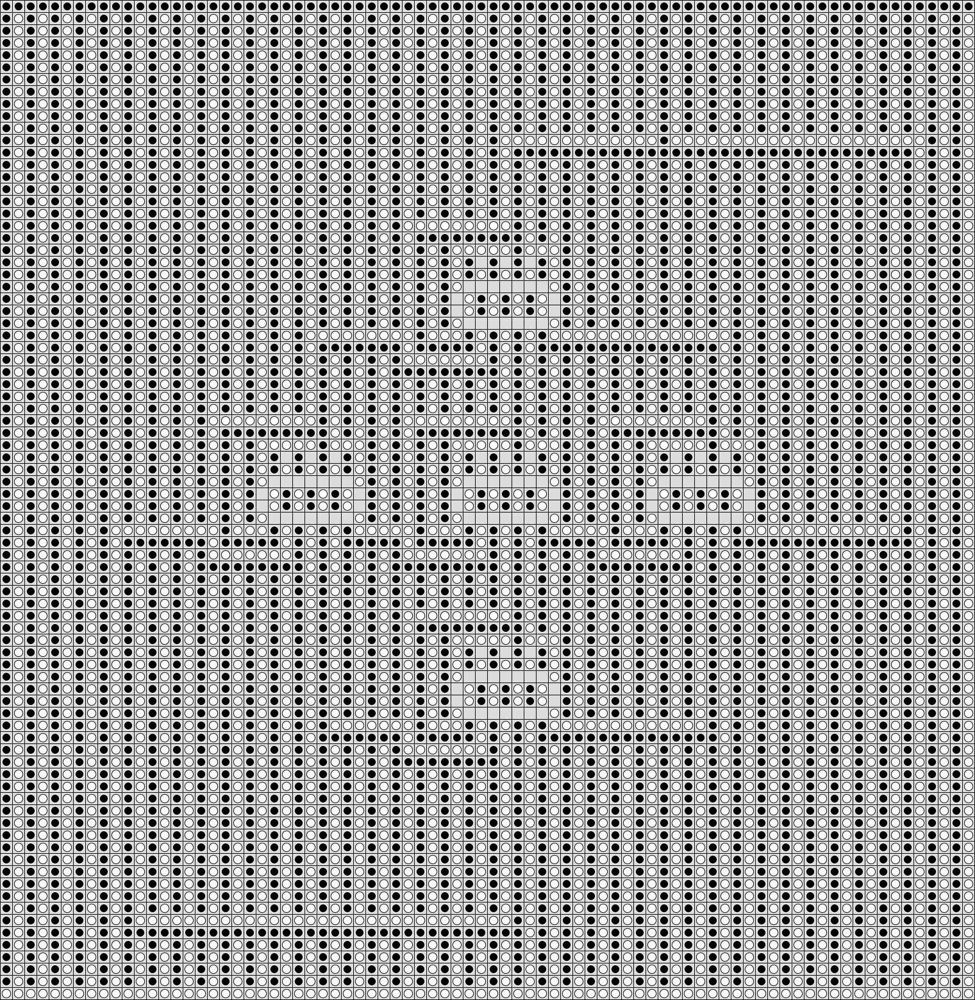](puzzles/big_example_16x16_solved.svg)

## Gadgets without 2&times;2 Constraint

These gadgets (from Section 2.1 of the paper) are for the simpler variation of
Yin-Yang where 2&times;2 squares are allowed to be monochromatic (all black
or all white).

### Vertex Gadget

Vertex Gadget | Broken-Vertex Solution | Unbroken-Vertex Solution
:----:|:----:|:----:
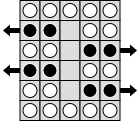 | 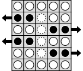 | 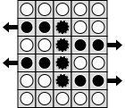

9&times;9 vertex gadget for easy tiling of gadgets:

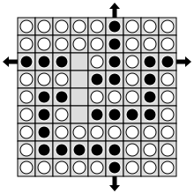

### Edge Gadget

9&times;9 edge gadget for easy tiling of gadgets:

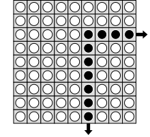

## Gadgets with 2&times;2 Constraint

These gadgets (from Section 2.2 of the paper) are for the full Yin-Yang rules
where 2&times;2 squares are forbidden from being monochromatic (all black
or all white).

### Filler (Background)

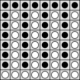

### Edge Gadget

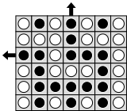

16&times;16 edge gadget for easy tiling of gadgets:

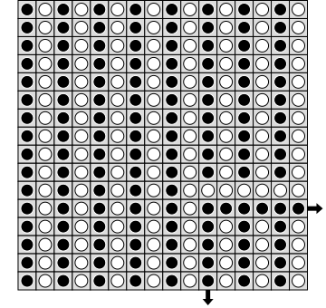

### Vertex Gadget

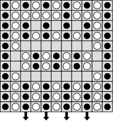

Broken-Vertex Solution | Unbroken-Vertex Solution
:----:|:----:
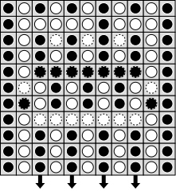 | 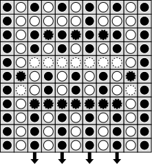

16&times;16 vertex gadget for easy tiling of gadgets:

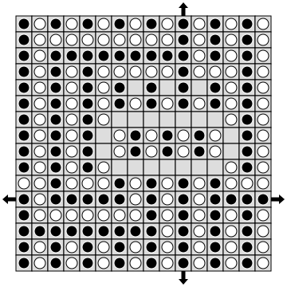
